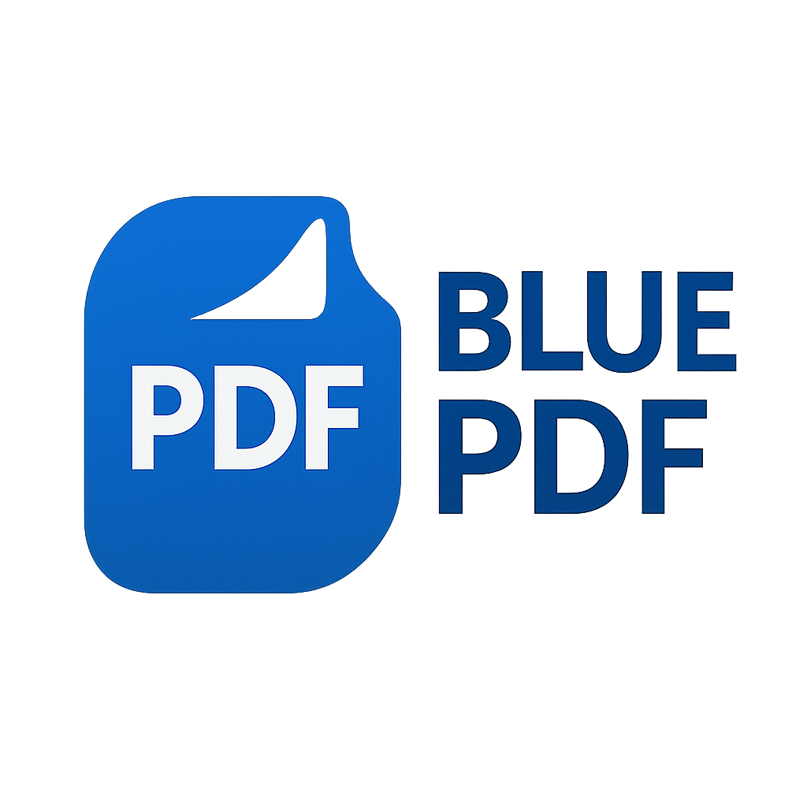

# 📄 BLUE PDF — Professional PDF Management App

<div align="center">
  

  [](https://flutter.dev/)
  [](https://developer.android.com/)
  [](LICENSE)
  [](pubspec.yaml)
</div>

---

### ⚡ Lightning-Fast PDF Tools
Merge, split, encrypt, and convert PDFs with unmatched speed.  
Optimized for Android using native rendering & parallel processing.

---

### ✨ Features at a Glance

- 📄 **Merge, Split, Encrypt & Unlock PDFs**
- 🖼️ **Image to PDF** with rotation and camera support
- 🌙 **Dark/Light Theme** UI with grid/list views
- 📦 **Compressed Output** and optimized memory usage
- 📸 **Built-in Camera Capture** for instant PDF creation

---

### 🛠 Tech Stack

- **Flutter 3.8.1**, Riverpod, Material 3 UI  
- **Kotlin**, PDFBox-Android, ProImageEditor  
- 📁 Supports PDF, JPG, PNG, GIF → Outputs PDF

---

### 🚀 Quick Start

```bash
git clone https://github.com/WannaCry016/blue_pdf.git
cd blue_pdf
flutter pub get
flutter run
```

### 📦 Build APK

```bash
flutter build apk --release
```

---

### 📄 License

This project is licensed under the **GNU Affero General Public License v3.0**.  
You may copy, distribute, or modify it under the same terms.

Additional terms:

- Includes **MuPDF**, also AGPL-3.0 ([source](https://mupdf.com))
- If redistributed or hosted, **source code must remain public**

📄 See full terms in [LICENSE](LICENSE)

---

### 🙏 Credits

- Flutter, Riverpod, MuPDF, and the open-source community  
- Built & maintained by **Ayushman Pal**

📧 Contact: [payushman72@gmail.com](mailto:payushman72@gmail.com)  
🔗 GitHub: [@WannaCry016](https://github.com/WannaCry016)

---

<div align="center">
  ⭐ Star this repo if it helped you • Contributions welcome!
</div>
